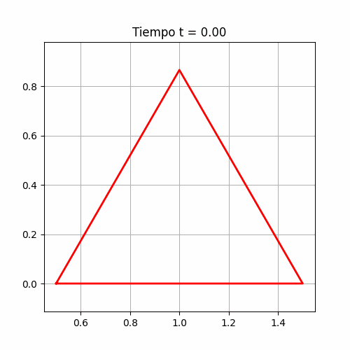
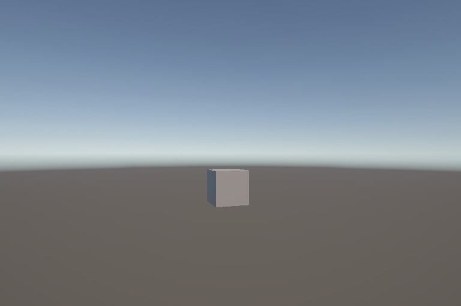
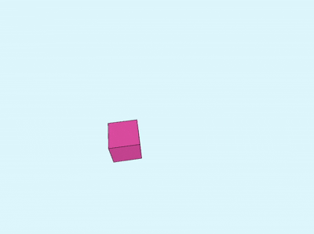

# Taller 0 - Transformaciones Básicas en Computación Visual

Este repositorio contiene las implementaciones realizadas para el Taller 0 del curso de Computación Visual. Cada punto del enunciado fue resuelto en su respectivo entorno, aplicando transformaciones geométricas y animándolas en función del tiempo.

## 👩‍💻 Autora

**Mariana García**  
Taller de Computación Visual  
Abril 2025  
Universidad Nacional de Colombia

---

## 1. Python

### Implementación

En esta parte se desarrolló una animación 2D (triángulo), aplicando transformaciones geométricas con matrices:

- Se usó **`numpy`** para definir los puntos base y construir las matrices de transformación.
- Se aplicaron secuencialmente:
  - **Rotación** sobre el centro
  - **Traslación** dinámica en el eje X
  - **Escalado** progresivo con base en una función seno.
- Se generó una secuencia de imágenes usando `matplotlib` y se guardó un **GIF animado** con `imageio`.

### Archivo:
- `python/Punto_1_Taller_0_Computación_visual.ipynb`

### 🎥 Resultado:
- 

---

## 2. Unity

### Implementación
- Se creó un proyecto 3D vacío en Unity (versión LTS).
- Se agregó un **cubo** a la escena.
- Se escribió un script en **C#** con:
  - **Traslación aleatoria** por eje X o Y cada ciertos segundos.
  - **Rotación constante** usando `Time.deltaTime`.
  - **Escalado oscilante** usando `Mathf.Sin(Time.time)`.
- Se utilizaron correctamente `transform.Translate()`, `transform.Rotate()` y `transform.localScale`.

### Archivo:
- `unity/TransformacionesCubo.cs`

### 📷 Captura:
- 

---

## 3. Three.js con React Three Fiber

### Implementación
- Se creó un proyecto React con `Vite` y `@react-three/fiber`.
- Se agregó un cubo 3D que:
  - **Se traslada** en una trayectoria circular (con `sin` y `cos`).
  - **Rota sobre su eje** (usando `useFrame`).
  - **Se escala** cíclicamente con `Math.sin(clock.elapsedTime)`.
- El fondo es azul claro (`lightblue`) y el cubo es rosa.
- Se evitó usar `@react-three/drei` para asegurar compatibilidad ya que presenté varios problemas en la compatibilidad.

### Proyecto:
- `threejs/transformaciones-threejs/`

### 🎥 Resultado:
- 

---

## 4. Processing (P3D)

### Implementación
- Se usó el modo `P3D` para trabajar en 3D.
- Se dibujó un cubo que:
  - Se **traslada** en forma ondulada con `sin()` y `cos()`.
  - Se **rota** sobre `X` e `Y`.
  - Se **escala** en función de `sin()`.
- Se encapsularon las transformaciones usando `pushMatrix()` y `popMatrix()`.
- El fondo es azul muy claro y el cubo es rosa.

### Archivo:
- `processing/transformaciones_processing.pde`

### 📷 Captura:
- 

---

## Instrucciones generales

1. Clonar el repositorio o descargar los archivos.
2. Ejecutar:
   - `python`: desde Colab o Jupyter.
   - `threejs`: con `npm install` y `npm run dev`.
   - `processing`: abrir con Processing y presionar Play.
3. Consultar cada carpeta para ver los códigos y visualizaciones.
