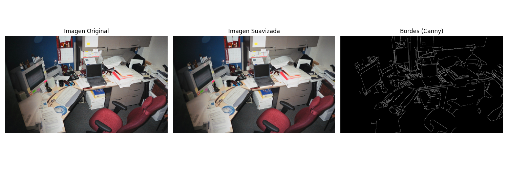

# Ejercicio 1 - Procesamiento de Imágenes y Detección de Objetos con YOLOv8

Este ejercicio muestra una serie de pasos básicos en procesamiento de imágenes utilizando OpenCV y detección de objetos con un modelo preentrenado YOLOv8. Se trabaja con una imagen estática y se visualizan tres etapas principales del procesamiento, además de una etapa de inferencia con aprendizaje profundo.

## 📌 Actividades realizadas

1. **Carga de imagen**: Se carga una imagen en formato BGR y se convierte a RGB para su correcta visualización con `matplotlib`.
2. **Aplicación de filtro de suavizado**: Se aplica un filtro Gaussiano para reducir el ruido y suavizar la imagen.
3. **Detección de bordes**: Se utiliza el algoritmo de Canny para detectar los contornos principales de la imagen suavizada.
4. **Visualización**: Se muestran las tres imágenes:
   - Imagen original
   - Imagen suavizada
   - Bordes detectados
5. **Detección de objetos con YOLOv8**:
   - Se utiliza el modelo preentrenado `yolov8n.pt`.
   - Se realiza la inferencia sobre la imagen original.
   - Se visualiza la imagen con los objetos detectados (bounding boxes y etiquetas).

## 🛠 Requisitos

Instala los siguientes paquetes antes de ejecutar el script:

```bash
pip install opencv-python matplotlib ultralytics
````

## 📁 Archivos requeridos

* `image.jpg`: Imagen de entrada sobre la cual se realizarán los procesos.
* `yolov8n.pt`: Modelo preentrenado de YOLOv8 (puede ser reemplazado por cualquier otro `.pt` compatible).

## ▶️ Ejecución

Ejecuta el script en un entorno Python:

```bash
python procesamiento.py
```

## 📌 Resultado esperado

Se mostrarán cuatro visualizaciones:




1. Imagen original
2. Imagen suavizada
3. Bordes detectados (Canny)
4. Imagen con los objetos detectados usando YOLOv8

## ✍️ Autor

* Lizeth Mariana Garcia Duarte


```
