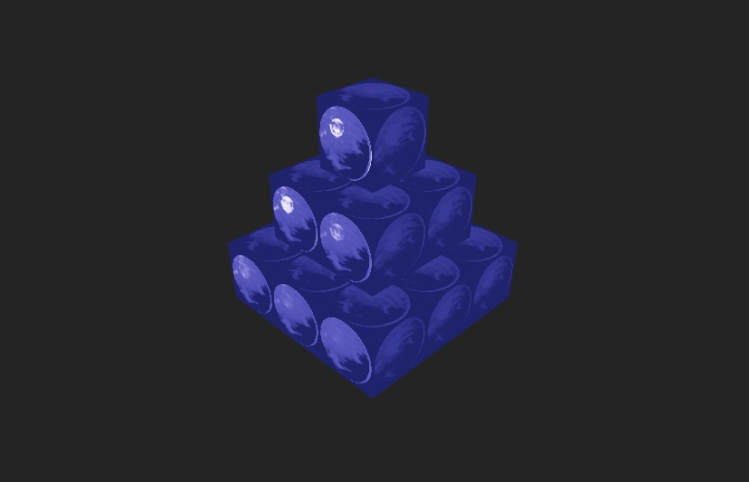

# 🧱 Ejercicio 2 – Pirámide Escalonada 3D con React Three Fiber

En este ejercicio construí una escena 3D interactiva utilizando **React Three Fiber**, una herramienta que permite integrar Three.js con React de forma declarativa.

El objetivo fue crear una **pirámide escalonada** compuesta por múltiples cajas (`Box`), aplicando materiales PBR (Physically Based Rendering) con texturas realistas. También se incorporó iluminación adecuada y controles de cámara para una experiencia inmersiva.

---

## ✨ ¿Qué hice?

✅ Inicialicé un proyecto con **Vite + React** y añadí las dependencias necesarias, tuve que hacerlo en local:
`three`, `@react-three/fiber`, `@react-three/drei`.

✅ Construí una pirámide 3D apilando cajas (`BoxGeometry`) de forma escalonada.

✅ Apliqué texturas PBR reales (color, normal, roughness, metallic) descargadas desde [ambientCG](https://ambientcg.com).

✅ Configuré iluminación ambiental y puntual para dar profundidad a la escena.

✅ Incorporé controles de cámara con `OrbitControls` para permitir al usuario rotar y acercar la vista de forma interactiva.

---

## 🎨 Texturas utilizadas

Las texturas fueron colocadas en:
`public/textures/brick/`

Archivos usados:

* `Ice002_1K-JPG_Color.jpg`
* `Ice002_1K-JPG_NormalGL.jpg`
* `Ice002_1K-JPG_Roughness.jpg`
* `Ice002_1K-JPG_Displacement.jpg`

---

## ▶️ ¿Cómo correrlo?

1. Instala las dependencias:

```bash
npm install
```

2. Ejecuta el servidor local:

```bash
npm run dev
```

3. Abre el navegador en `http://localhost:5173/`

---

## 🖼 Resultado final

Se obtiene una **pirámide de ladrillos en 3D**, con texturas físicas realistas, buena iluminación y una cámara que se puede mover libremente.



> *Captura de la pirámide renderizada. Puedes agregar tu imagen en `docs/preview.png`.*

---

## ✍️ Autoría

Ejercicio desarrollado por
**Lizeth Mariana Garcia Duarte**
