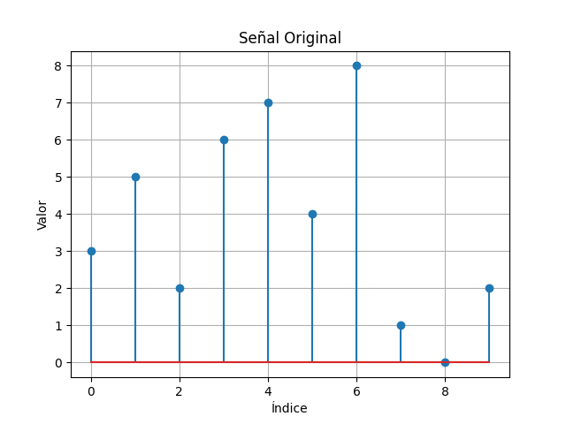
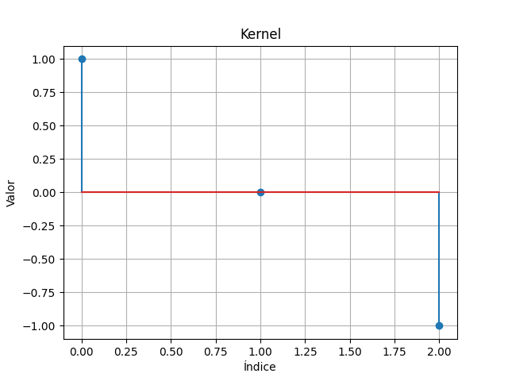
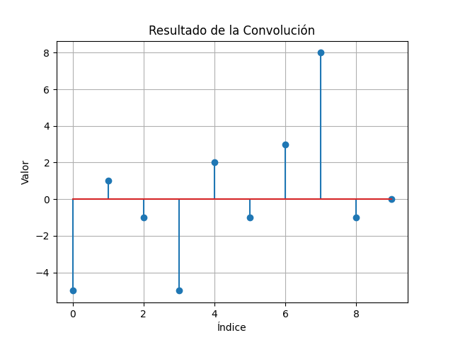

# Ejercicio 3 - Convolución Unidimensional en Python

Este ejercicio consiste en implementar desde cero una función que realiza una convolución 1D entre una señal y un kernel, sin utilizar funciones predefinidas como `numpy.convolve`.

## 📌 Actividades realizadas

- Se define una señal de entrada de 10 valores.
- Se define un kernel de tamaño 3 (por ejemplo: `[1, 0, -1]`).
- Se implementa manualmente la operación de convolución.
- Se grafican:
  - La señal original
  - El kernel
  - El resultado de la convolución
- Todos los gráficos se guardan automáticamente en la carpeta `graficos/`.

## 🛠 Requisitos

Instala las dependencias necesarias con:

```bash
pip install matplotlib
````

## ▶️ Ejecución

Desde la carpeta `ejercicio_3_convolucion_1d`, ejecuta:

```bash
python convolucion.py
```

Esto generará tres imágenes en la subcarpeta `graficos/`:

* `senal_original.png`
* `kernel.png`
* `resultado.png`

## 🖼 Resultado Final

A continuación, se muestran ejemplos de los resultados generados:

### Señal Original



### Kernel



### Resultado de la Convolución



## ✍️ Autor

* Lizeth Mariana Garcia Duarte